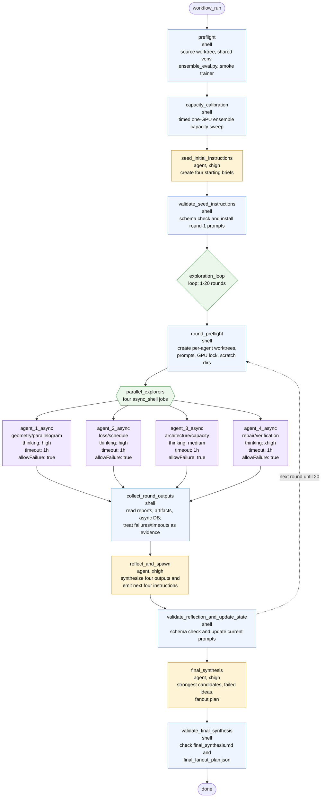

# batched-neural-repair-verification-loop

## Operational Flow

1. Preflight creates a detached source worktree from `origin/konrad-manual-sweep`, builds one shared venv, installs the scratch-only `ensemble_eval.py` helper, and runs a tiny smoke training check.
2. Capacity calibration runs a bounded CUDA ensemble sweep and writes `state/capacity_calibration.json`.
3. A seed agent turns the design brief and calibration into four starting search briefs.
4. Each loop round creates four isolated worktrees and launches four async explorer jobs in parallel.
5. Explorer failures and timeouts are intentionally collected as search evidence rather than hard-stopping the workflow.
6. A reflection agent synthesizes the round and writes the next four instructions.
7. After the loop budget, a final synthesis agent writes `final_synthesis.md` and `final_fanout_plan.json`, then a shell gate validates those outputs.

## Key Runtime Paths

- Workflow spec: `.pi/workflows/batched-neural-repair-verification-loop.json`
- Helper script: `.pi/scripts/batched_neural_workflow.py`
- Slurm wrapper: `slurm/run_batched_neural_repair_verification_loop.sbatch`
- Current output root: `/scratch/htc/npelleriti/pi-sandbox/batched-neural-repair-verification-loop/job_1339429`
- Async DB: `{outputRoot}/jobs/batched-neural-repair-verification-loop.sqlite`
